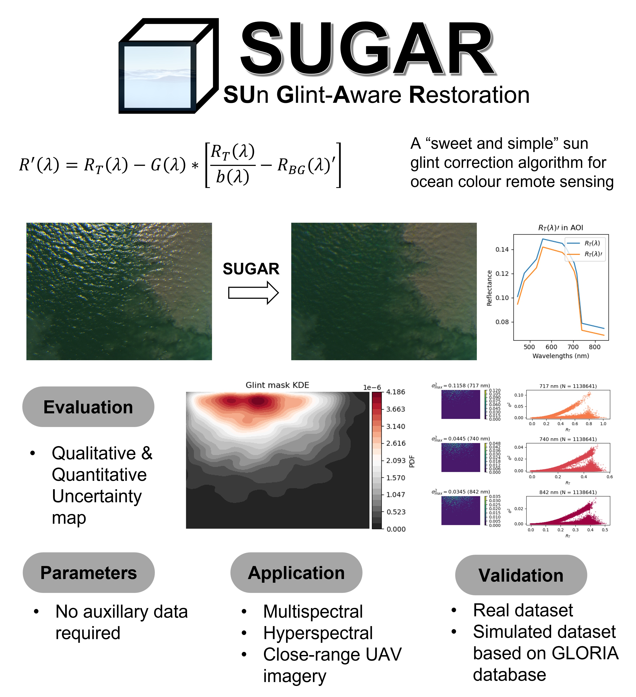

# SUn Glint Aware Restoration (SUGAR)

A *sweet, and simple* algorithm for sun glint correction of high resolution UAV imagery (applicable for both multispectral (MSI) and hyperspectral images (HSI) with sub-meter spatial resolution)

## Tutorial

- A "How-to-use" guide provided by the sugar notebook - `SUGAR.ipynb`

## Comments

- The **only** required input that SUGAR requires is a numpy array of $(m,n,c)$, where $m, n$ are the spatial dimensions of the image, and $c$ is the number of channels of the image (applicable for multispectral/hyperspectral images)
- The nature of the input type is a reflectance image (ranges from 0 - 1), with dtype==float

### MicaSense usage
- Requirements follow that of [MicaSense image processing library](https://github.com/micasense/imageprocessing)
- Install [ExifTool](https://exiftool.org/)
- See [MicaSense setup](https://github.com/micasense/imageprocessing/blob/master/MicaSense%20Image%20Processing%20Setup.ipynb)

# Set up
- Be sure to check the requirements required if you are using MicaSense MSI imageries
- Create a virtual environment with: `conda env create -f sgc.yml`
- activate `SUGAR`

# Enquiries
Feel free to email pakhuiying95@gmail.com for any issues/bugs encountered, or just file an issue on github directly